# アーキテクチャ設計書

草野球チーム運営支援システムのアーキテクチャを、アウトサイドインで設計する。

---

## 0. プロダクトビジョン

### 何を売るのか

ツールではない。**草野球チーム運営のテンプレート**をシステムに焼き込んだもの。

既存ツール（調整さん、伝助、Play等）は「箱」を提供するだけで、使い方は代表が自分で考える。
このプロダクトは**運営フロー自体が組み込まれている**。代表は初期設定をするだけで、あとはシステムが回る。

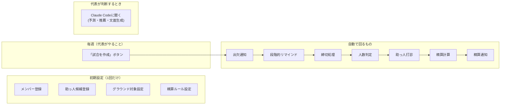

### なぜ価値があるか

草野球チーム運営の悩みは驚くほど共通している。出欠が返ってこない、人数足りない、
グラウンド確保が大変、精算がめんどくさい、代表が孤軍奮闘。全チーム共通の課題。

このプロダクトは、実際のチーム運営（Xeros: 2003年設立、年間50試合以上）で蓄積された
運営ノウハウをテンプレートとしてシステムに焼き込んでいる。新しいチームの代表が
使い始めた瞬間に、ベストプラクティスが自動的に適用される。

### 通知チャネル戦略

LINE Messaging APIの無料枠は月200通。メンバー15人×月4試合のリマインドでギリギリ。
費用をかけずにスケールするため、メール（Gmail）を併用する。

| 通知種別 | チャネル | 理由 |
|---------|---------|------|
| 初回出欠依頼 | LINE Push | 気づきやすい。月4回×15人=60通 |
| リマインド | メール + Webリンク | LINE通数を消費しない |
| 精算通知 | メール + Webリンク | 金額詳細はメールの方が見やすい |
| 緊急連絡(雨天中止等) | LINE Push | 即時性が必要 |

メールからの回答はWebページ上の1タップで完結する（チャット風UI不要、ボタン1つ）。

### スマホアプリ戦略

LINE通数制限の根本的解決として、メンバー向けスマホアプリを提供する。
プッシュ通知が無料・無制限で使えるため、通知チャネルの制約がなくなる。

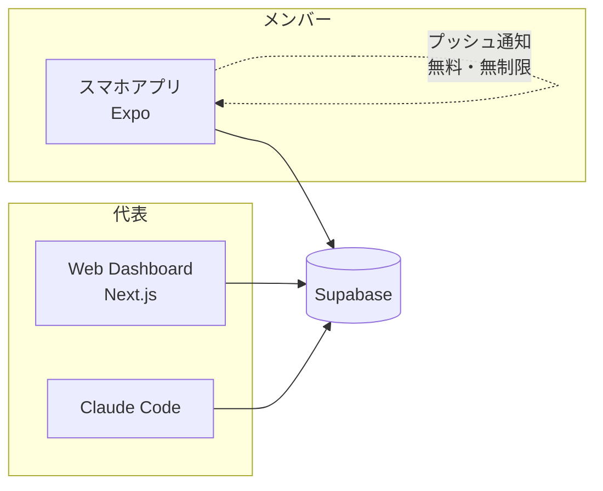

**カレンダー連携:**
- Googleカレンダー: 試合確定時に自動追加（場所・時間・持ち物）
- TimeTree: 共有カレンダーに反映（家族に予定が見える）
- カレンダー側のリマインドも活用できる（アプリ通知と二重で気づく）

**インストール障壁の対策:**
- メンバーに「新しいツールを覚えさせない」原則との矛盾があるが、
  アプリは1回インストールすれば通知タップ→出欠回答の2アクションで完結。
  調整さん等のWebツールより体験は良い。
- LINE公式アカウントのリッチメニューからアプリへの導線を用意することで、
  LINEの延長として使わせる。

---

## 1. アウトサイドイン: ユーザーストーリーから始める

### 1.1 アクターの定義

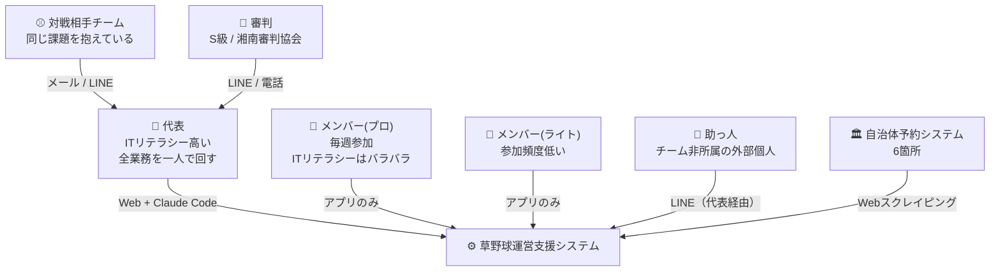

### 1.2 コアユーザーストーリー（代表の1週間）

Phase 1で解決すべきストーリーを時系列で並べる。

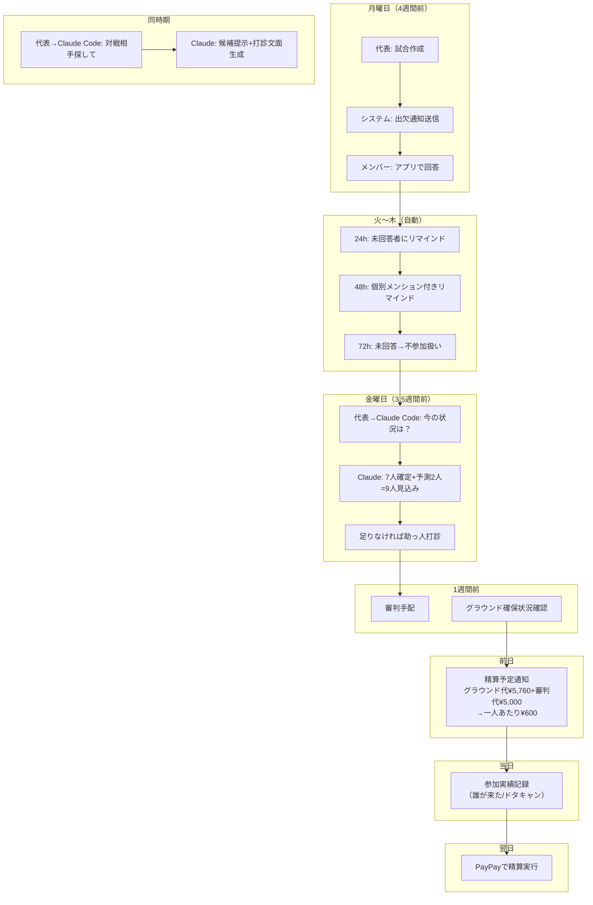

### 1.3 メンバー側のユーザーストーリー（最小限）

メンバーがやることは**アプリで2タップ以内**で完結する。

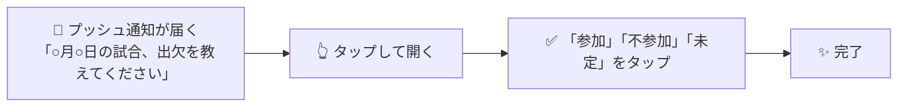

メンバーはアカウント登録不要（Google/LINEログインで完結）。

---

## 2. システムコンテキスト図

### 2.1 コンテキスト境界

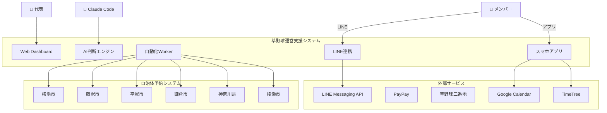

### 2.2 システム外のもの（境界の外）

| 対象 | なぜ外か | 連携方法 |
|------|---------|---------|
| 草野球三番地 | プラットフォーム。置き換えない | 手動（募集URLをコピペ） |
| PayPay | 決済API非公開（個人利用） | 精算額を計算してアプリ通知。実際の送金は手動 |
| 対戦相手チーム | 相手はシステムを使わない | メール/LINE文面を生成して代表が送信 |
| 審判 | 少人数の個人 | LINE/電話で代表が手配 |
| スポーツ保険 | 年1回の手続き | スコープ外 |

### 2.3 システム内のもの（境界の内）

| 機能 | トリガー | AI要否 |
|------|---------|--------|
| 試合(Game)作成 | 代表がWeb or Claude Codeで作成 | 不要 |
| 出欠通知送信 | Game作成時に自動 | 不要 |
| 出欠回答受付 | メンバーがアプリでタップ | 不要 |
| 段階的リマインド | Cron（24h/48h/72h） | 不要 |
| 締切自動進行 | Cron（締切到来時） | 不要 |
| 出席予測・人数判定 | 代表がClaude Codeで問い合わせ | **必要** |
| 助っ人候補推薦 | 代表がClaude Codeで問い合わせ | **必要** |
| 助っ人打診 | 代表がClaude Codeから指示 | 一部必要（文面生成） |
| 対戦相手打診文面生成 | 代表がClaude Codeから指示 | **必要** |
| 参加実績記録 | 代表がアプリ or Claude Codeで入力 | 不要 |
| 精算計算 | 参加実績確定後に自動 | 不要 |
| 精算通知 | 代表が確認後に送信指示 | 不要 |
| グラウンド空き監視 | Cron（定期スクレイピング） | 不要 |
| グラウンド空き通知 | 空き検出時に自動 | 不要 |
| 個人成績集計 | 試合結果入力後に自動 | 不要 |
| 区分変更提案 | 代表がClaude Codeで問い合わせ | **必要** |
| 週次レポート | 代表がClaude Codeで生成 | **必要** |

---

## 3. ロジカルアーキテクチャ

### 3.1 レイヤー構成

```mermaid
graph TB
    subgraph "プレゼンテーション層"
        WD["Web Dashboard<br>(代表専用)"]
        APP["スマホアプリ<br>(メンバー用)"]
        LINE_BOT["LINE Bot<br>(フォールバック)"]
        CC["Claude Code<br>(代表専用)"]
    end

    subgraph "アプリケーション層"
        subgraph "ユースケース群"
            UC1["試合ライフサイクル管理<br>作成→出欠収集→人数判定→確定→精算"]
            UC2["出欠管理<br>通知→回答受付→リマインド→締切処理"]
            UC3["助っ人管理<br>候補DB→打診→回答→充足→自動キャンセル"]
            UC4["対戦相手管理<br>チームDB→打診→交渉→確定→他チームキャンセル"]
            UC5["精算管理<br>費用入力→一人あたり算出→PayPayディープリンク"]
            UC6["グラウンド監視<br>対象登録→定期チェック→空き通知"]
            UC7["個人成績<br>打席結果入力→自動集計→スタッツ表示"]
        end

        subgraph "AI判断サービス"
            AI1["出席予測（過去実績ベース）"]
            AI2["助っ人推薦（候補リスト+過去参加実績）"]
            AI3["文面生成（対戦打診、リマインド等）"]
            AI4["メンバー区分変更提案"]
        end
    end

    subgraph "ドメイン層"
        DM1["Team / Member / Helper"]
        DM2["Game / RSVP / Attendance"]
        DM3["Opponent / Negotiation"]
        DM4["Ground / GroundSlot"]
        DM5["Expense / Settlement"]
        DM6["GameResult / AtBat / PitchingStat"]
        DM7["NotificationLog / AuditLog"]
    end

    subgraph "インフラストラクチャ層"
        DB["Supabase PostgreSQL"]
        LINE_API["LINE Messaging API"]
        SCRAPER["自治体予約サイト<br>スクレイパー"]
        PUSH["Expo Notifications"]
        CAL["Google Calendar / TimeTree API"]
    end

    WD & APP & LINE_BOT & CC --> UC1 & UC2 & UC3 & UC4 & UC5 & UC6 & UC7
    CC --> AI1 & AI2 & AI3 & AI4
    UC1 & UC2 & UC3 & UC4 & UC5 & UC6 & UC7 --> DM1 & DM2 & DM3 & DM4 & DM5 & DM6 & DM7
    DM1 & DM2 & DM3 & DM4 & DM5 & DM6 & DM7 --> DB & LINE_API & SCRAPER & PUSH & CAL
```

### 3.2 ドメイン境界（Bounded Context）

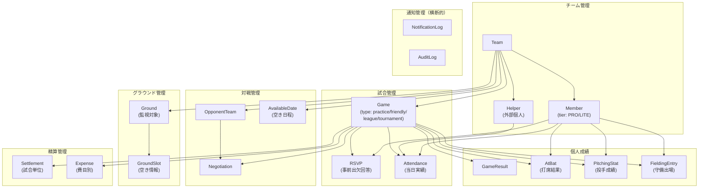

### 3.3 通知ドメイン（横断的関心事）

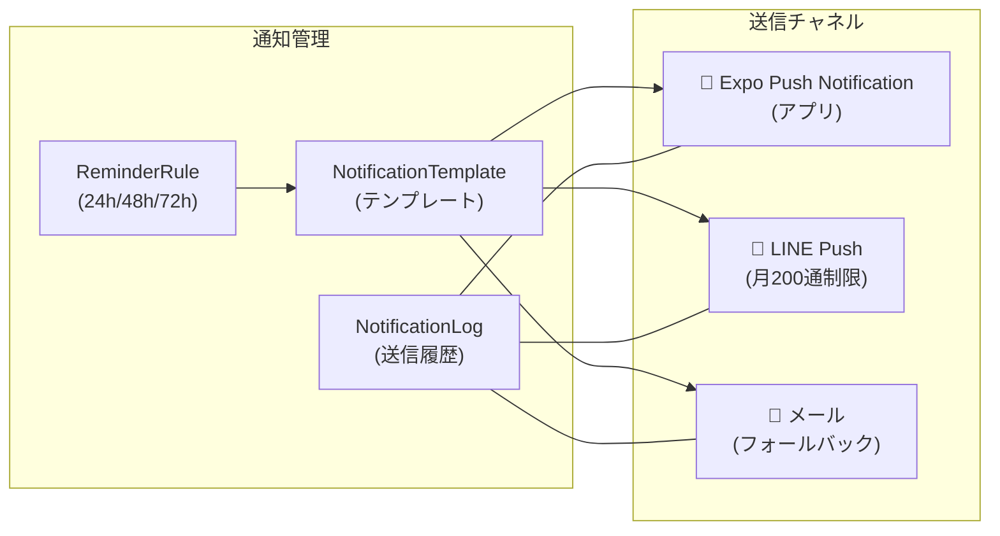

### 3.4 試合ライフサイクル（状態遷移）

インタビュー結果に基づき、現行SPEC.mdの状態遷移を修正。

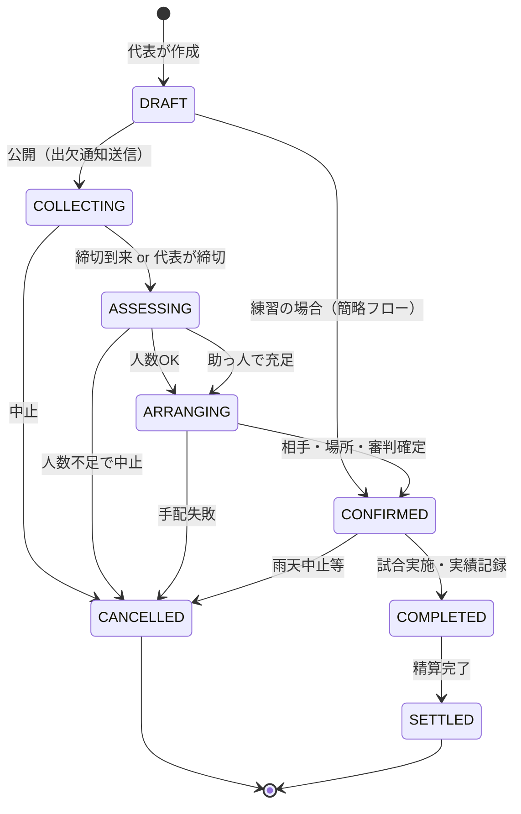

---

## 4. 物理アーキテクチャ

### 4.1 デプロイメント構成

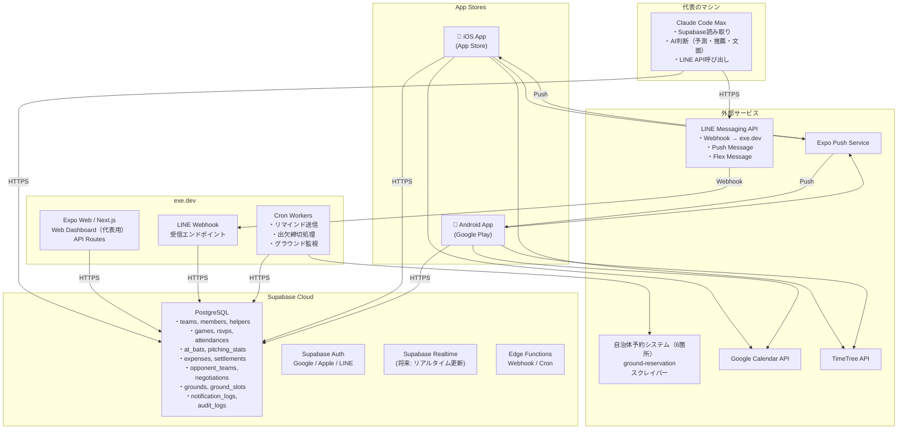

### 4.2 Vercel vs exe.dev の判断

| 項目 | Vercel | exe.dev |
|------|--------|---------|
| Next.js ホスティング | 得意 | 可能 |
| Cron Worker | 制限あり（Hobby: 1日1回） | 自由 |
| LINE Webhook 常時受信 | Serverless（コールドスタート） | 常時起動可 |
| 費用 | 無料枠あり | 契約済み |

**判断:** exe.devをメインのホスティングとし、Vercelは不要（exe.devでNext.jsもCronも動かせる）。
ただし、Vercelの方が便利であればVercel(フロント) + exe.dev(Worker)の分離も可。

### 4.3 AI実行の制約と設計

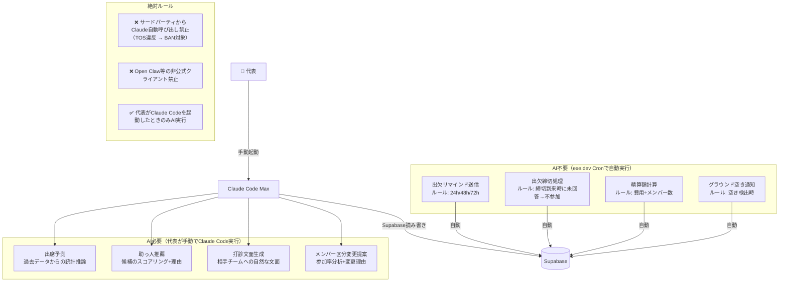

### 4.4 セキュリティ・プライバシー設計

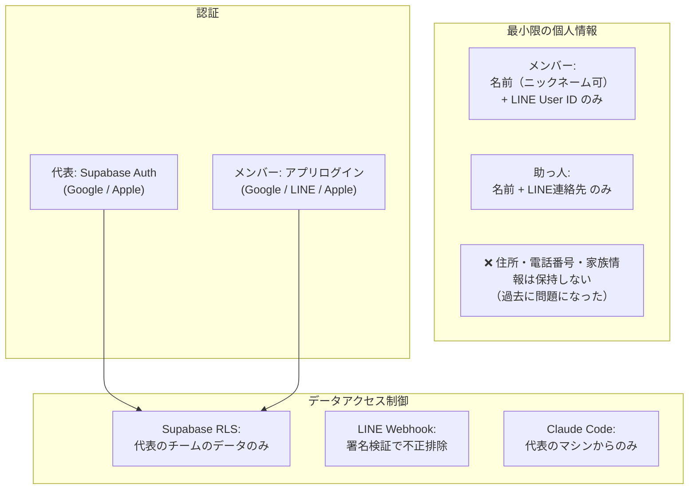

---

## 5. 技術スタック（確定）

| レイヤー | 技術 | 理由 |
|---------|------|------|
| フロントエンド | Expo (React Native) | iOS / Android / Web を1コードベースで |
| ルーティング | Expo Router | ファイルベース。Next.js App Routerと同じ感覚 |
| UI | NativeWind (Tailwind for RN) | Tailwind記法をReact Nativeで使える |
| 言語 | TypeScript (strict) | 既存実装を活かす |
| DB | Supabase PostgreSQL | SQLの強み（精算集計・統計）。無料枠十分 |
| 認証 | Supabase Auth | Google / Apple / LINE（カスタムOIDC） |
| クエリ | @supabase/supabase-js | Expoではssr不要。通常クライアント |
| プッシュ通知 | Expo Notifications | 無料・無制限。iOS/Android両対応 |
| サーバーサイドロジック | Supabase Edge Functions | Webhook受信、Cronジョブ（リマインド、締切処理等） |
| カレンダー連携 | Google Calendar API / TimeTree API | 試合確定時に自動追加 |
| ホスティング(Web) | exe.dev or Vercel | Expo for Webの配信 |
| グラウンド監視 | ground-reservation (Python) | 既存実装。exe.devに統合 |
| AI判断 | Claude Code Max | TOS準拠。代表が手動実行 |
| パッケージマネージャ | Bun | 既存実装 |
| Linter | Biome | 既存実装 |
| CI/CD | GitHub Actions + EAS Build | アプリビルドはExpo Application Services |
| テスト | Bun test (BDD) | 既存実装 |

### モノレポ構成（新）

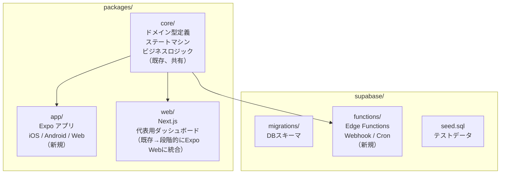

`packages/core` はフロントエンド（Expo）とサーバーサイド（Edge Functions）の両方から参照される。

---

## 6. 次のステップ

1. **データモデル設計** — ドメイン層のエンティティをSQLスキーマに落とす → ✅ `docs/data-model.md`
2. **LINE Bot設計** — Flex Message, Webhook, リッチメニューの設計
3. **Phase 1実装計画** — 出欠管理の最小ループを動かす
