# ER図・DFD（データフロー図）

GitHubで直接レンダリングされます。

---

## 1. ER図（エンティティ関連図）

### 1.1 全体概要

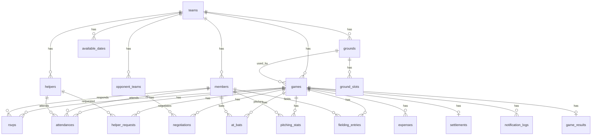

### 1.2 チーム管理コンテキスト

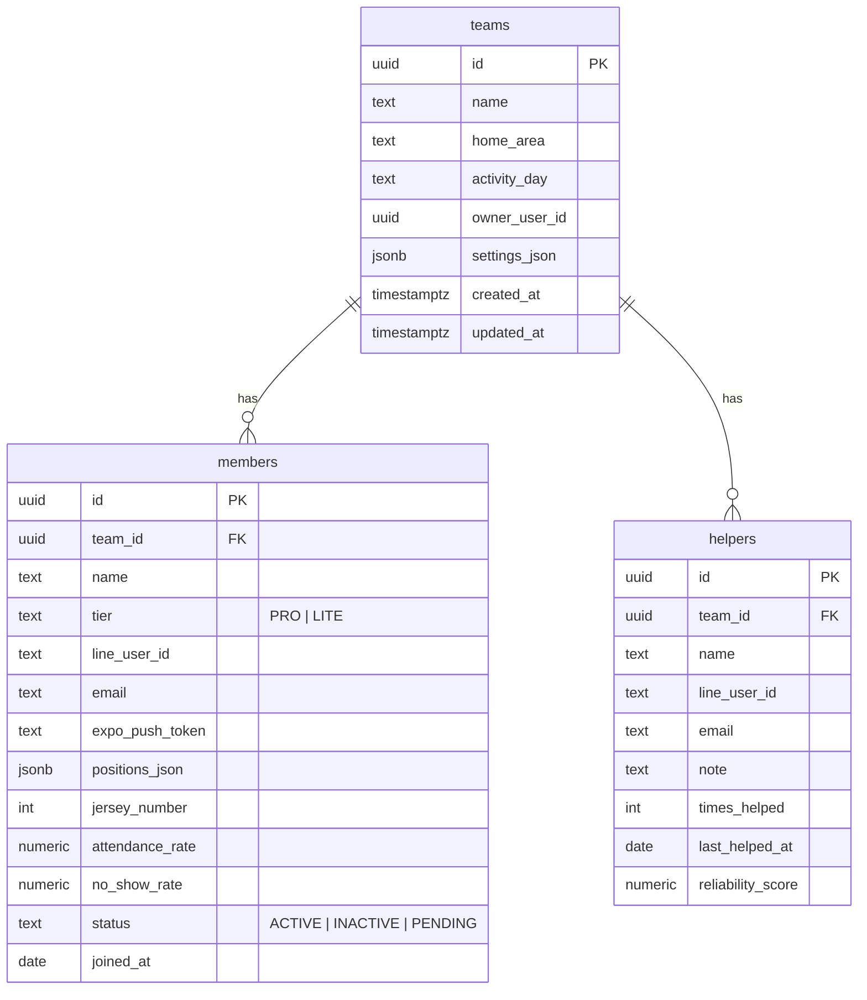

### 1.3 試合管理コンテキスト

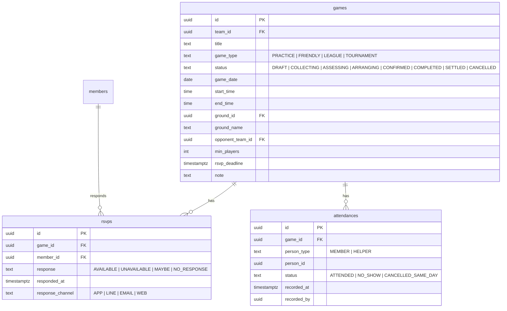

### 1.4 助っ人打診コンテキスト

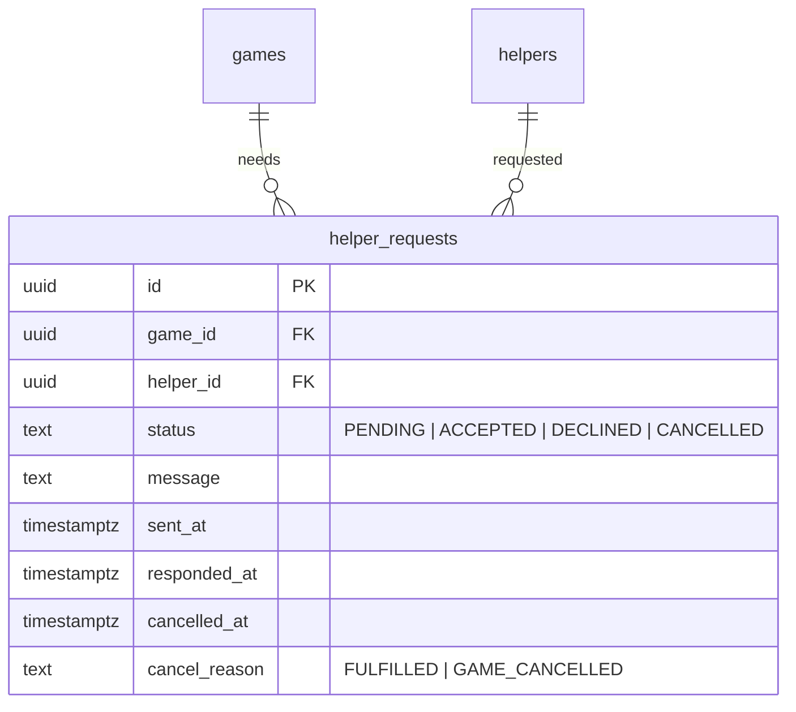

### 1.5 対戦交渉コンテキスト

```mermaid
erDiagram
    opponent_teams {
        uuid id PK
        uuid team_id FK
        text name
        text area
        text contact_name
        text contact_email
        text contact_line
        text contact_phone
        text home_ground
        text note
        int times_played
        date last_played_at
    }

    negotiations {
        uuid id PK
        uuid game_id FK
        uuid opponent_team_id FK
        text status "DRAFT | SENT | REPLIED | ACCEPTED | DECLINED | CANCELLED"
        jsonb proposed_dates_json
        text message_sent
        text reply_received
        timestamptz sent_at
        timestamptz replied_at
        timestamptz cancelled_at
        text cancel_reason "DATE_TAKEN | GAME_CANCELLED"
    }

    available_dates {
        uuid id PK
        uuid team_id FK
        date date
        text time_slot "MORNING | AFTERNOON | ALL_DAY"
        text status "AVAILABLE | PROPOSED | BOOKED"
        uuid game_id FK
    }

    opponent_teams ||--o{ negotiations : "negotiates"
    games ||--o{ negotiations : "has"
    teams ||--o{ available_dates : "has"
```

### 1.6 グラウンド管理コンテキスト

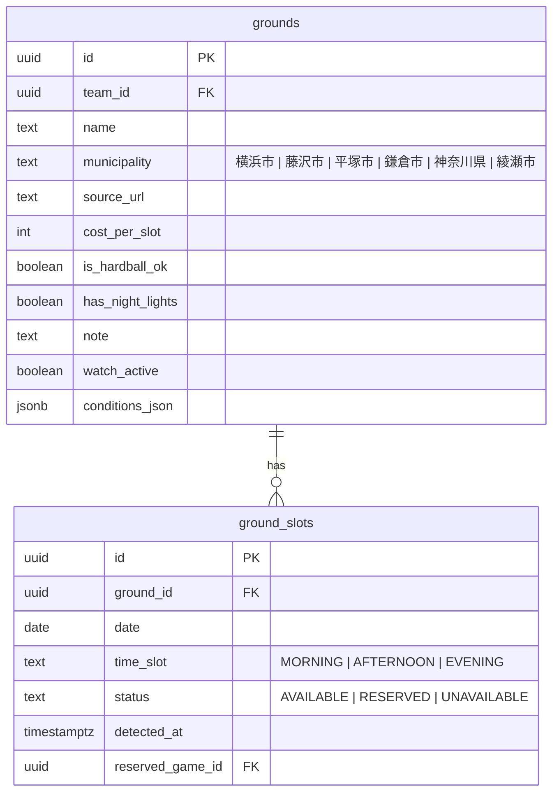

### 1.7 精算コンテキスト

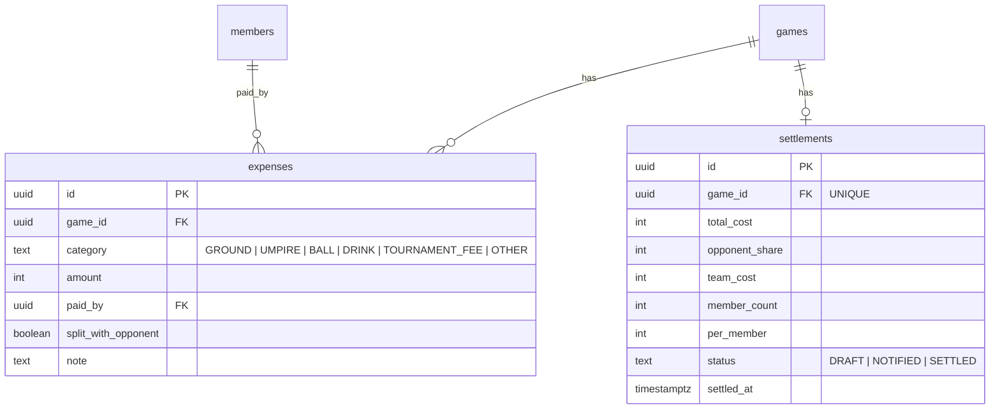

### 1.8 個人成績コンテキスト

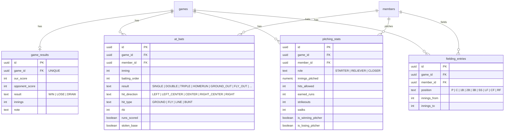

---

## 2. DFD（データフロー図）

### 2.1 コンテキスト図（レベル0）

システム全体を1つのプロセスとして表現。

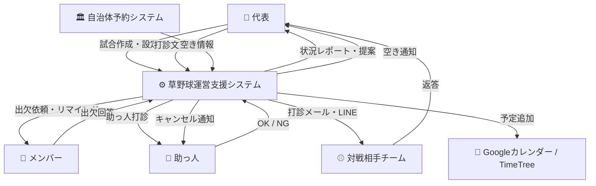

### 2.2 レベル1 DFD（主要プロセス分解）

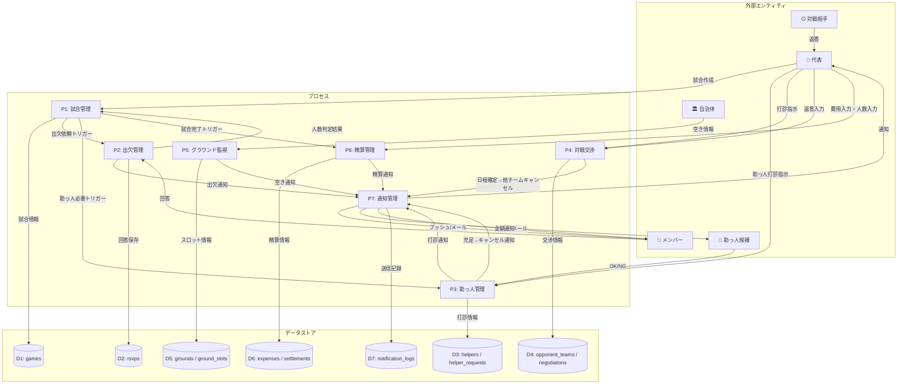

### 2.3 レベル2 DFD: P2 出欠管理（詳細）

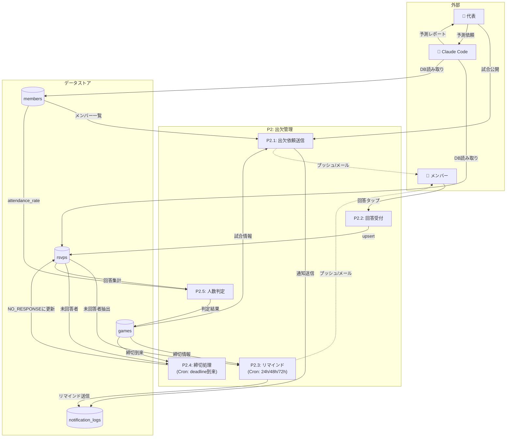

### 2.4 レベル2 DFD: P3 助っ人管理（詳細）

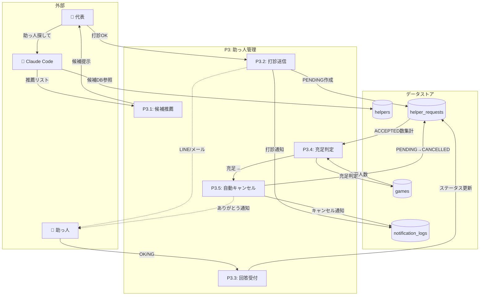

### 2.5 レベル2 DFD: P4 対戦交渉（詳細）

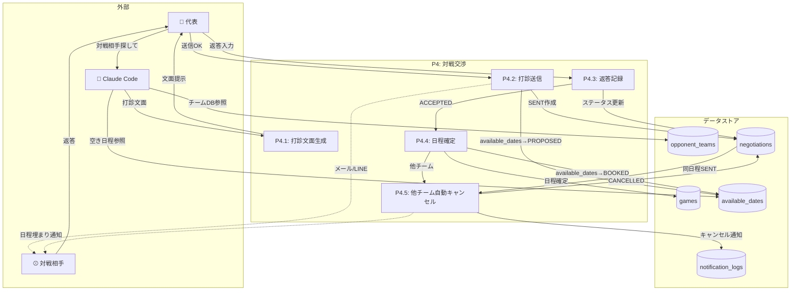

---

## 3. 試合ライフサイクル（状態遷移図）

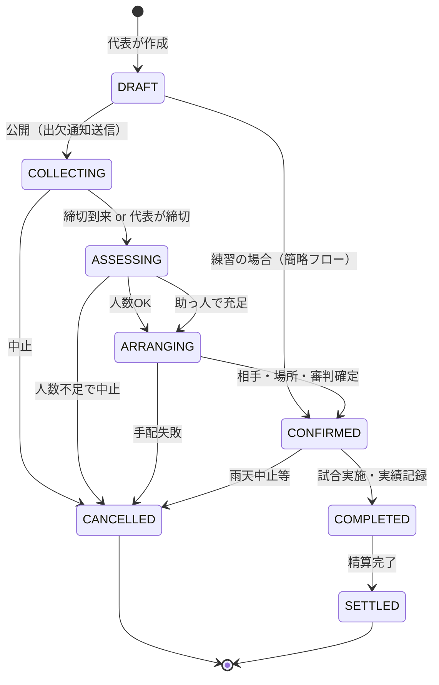

---

## 4. 助っ人打診フロー（シーケンス図）

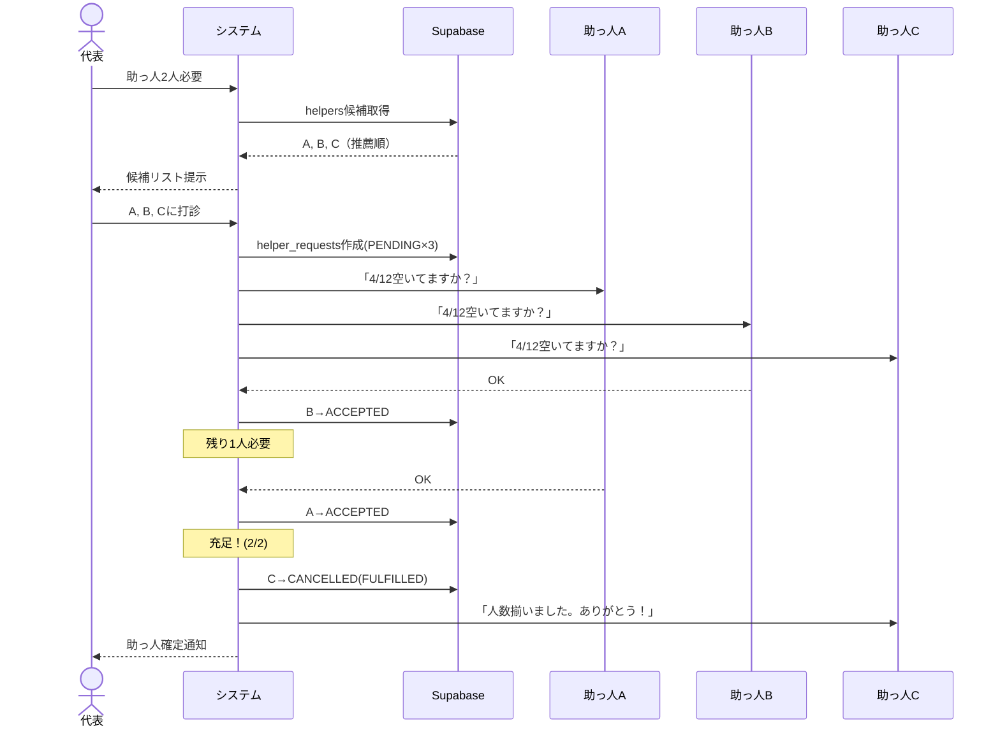

---

## 5. 対戦相手日程調整フロー（シーケンス図）

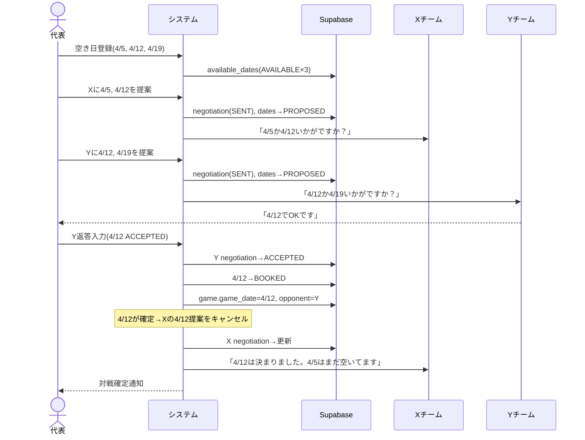
