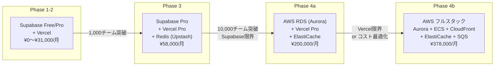
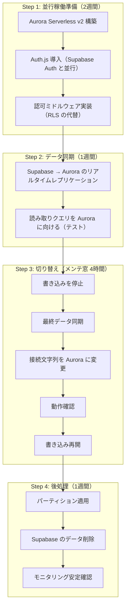
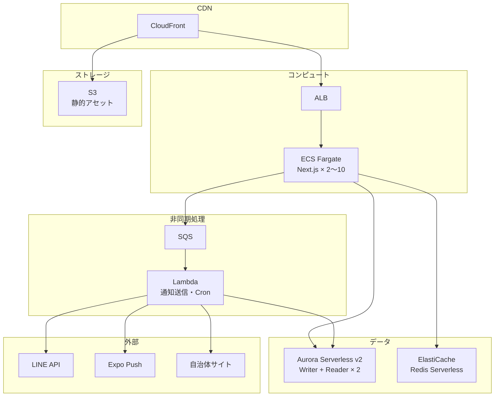
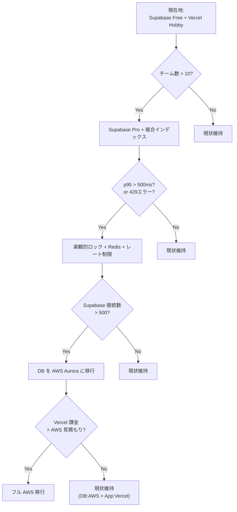

# 段階的マイグレーション戦略

Supabase + Vercel の「ゼロコスト起動」から、成長に応じて AWS に移行するロードマップ。
**原則: 動いているものを壊さない。ボトルネックが顕在化してから移行する。**

---

## 全体方針



---

## Phase 1→2: Supabase 内での最適化（0〜1,000チーム）

### トリガー条件
- チーム数が10を超えた
- Supabase Free の 500MB / 50 req/s に近づいた

### やること

| 作業 | 内容 | ダウンタイム |
|------|------|------------|
| Supabase Pro へアップグレード | ダッシュボードからボタン1つ | なし |
| 複合インデックス追加 | マイグレーション SQL 適用 | なし（CREATE INDEX CONCURRENTLY） |
| RLS ポリシー最適化 | team_id フィルタを全テーブルに | なし |
| API ページネーション実装 | カーソルベースに全 GET を変更 | なし（後方互換維持） |

### マイグレーション SQL

```sql
-- 00002_add_indexes_for_scale.sql

-- 「チームの進行中試合」を高速取得
CREATE INDEX CONCURRENTLY idx_games_team_status
  ON games(team_id, status);

-- 「試合の参加可能人数」を高速集計
CREATE INDEX CONCURRENTLY idx_rsvps_game_response
  ON rsvps(game_id, response);

-- 「メンバーの未回答出欠」を高速取得
CREATE INDEX CONCURRENTLY idx_rsvps_member_response
  ON rsvps(member_id, response)
  WHERE response = 'NO_RESPONSE';

-- 監査ログの直近取得（降順）
CREATE INDEX CONCURRENTLY idx_audit_logs_created_desc
  ON audit_logs(created_at DESC);

-- 通知ログの試合別・時系列取得
CREATE INDEX CONCURRENTLY idx_notification_logs_game_sent
  ON notification_logs(game_id, sent_at DESC);

-- 助っ人打診の試合別ステータス
CREATE INDEX CONCURRENTLY idx_helper_requests_game_status
  ON helper_requests(game_id, status);
```

### リスク
- **なし。** Supabase 内の作業のみ。アプリコードの変更は最小限。

---

## Phase 2→3: キャッシュ層 + 楽観的ロック（1,000〜10,000チーム）

### トリガー条件
- Supabase のクエリ統計で p95 レスポンスが 500ms を超えた
- 同時状態遷移で Lost Update が発生した（audit_logs で検知）
- 出欠回答のピーク時に 429 エラーが出始めた

### やること

| 作業 | 内容 | ダウンタイム |
|------|------|------------|
| 楽観的ロック導入 | games に version カラム追加 | なし |
| 出欠集計キャッシュ | games に available_count 等追加 + トリガー | なし |
| Redis 導入 | Upstash（サーバーレス Redis）接続 | なし |
| レート制限 | Vercel Edge Middleware 追加 | なし |
| Supabase RPC | 状態遷移をDB関数に集約（アプリロジック→DB） | なし |

### マイグレーション SQL

```sql
-- 00003_optimistic_locking.sql

-- 楽観的ロック
ALTER TABLE games ADD COLUMN version INTEGER NOT NULL DEFAULT 0;

-- 出欠集計キャッシュ
ALTER TABLE games ADD COLUMN available_count INTEGER NOT NULL DEFAULT 0;
ALTER TABLE games ADD COLUMN unavailable_count INTEGER NOT NULL DEFAULT 0;
ALTER TABLE games ADD COLUMN maybe_count INTEGER NOT NULL DEFAULT 0;
ALTER TABLE games ADD COLUMN no_response_count INTEGER NOT NULL DEFAULT 0;

-- 出欠回答時に集計を自動更新するトリガー
CREATE OR REPLACE FUNCTION update_rsvp_counts()
RETURNS TRIGGER AS $$
BEGIN
  UPDATE games SET
    available_count = (
      SELECT COUNT(*) FROM rsvps WHERE game_id = NEW.game_id AND response = 'AVAILABLE'
    ),
    unavailable_count = (
      SELECT COUNT(*) FROM rsvps WHERE game_id = NEW.game_id AND response = 'UNAVAILABLE'
    ),
    maybe_count = (
      SELECT COUNT(*) FROM rsvps WHERE game_id = NEW.game_id AND response = 'MAYBE'
    ),
    no_response_count = (
      SELECT COUNT(*) FROM rsvps WHERE game_id = NEW.game_id AND response = 'NO_RESPONSE'
    )
  WHERE id = NEW.game_id;
  RETURN NEW;
END;
$$ LANGUAGE plpgsql;

CREATE TRIGGER trg_rsvps_count_update
  AFTER INSERT OR UPDATE ON rsvps
  FOR EACH ROW EXECUTE FUNCTION update_rsvp_counts();
```

### 状態遷移の RPC 関数

```sql
-- 00004_transition_rpc.sql

-- アプリ側の「読み取り→判定→更新」を1つのDBトランザクションに集約
CREATE OR REPLACE FUNCTION transition_game_status(
  p_game_id UUID,
  p_expected_version INTEGER,
  p_new_status TEXT,
  p_actor_id TEXT
) RETURNS TABLE(success BOOLEAN, error TEXT, new_version INTEGER) AS $$
DECLARE
  v_current RECORD;
BEGIN
  -- 楽観的ロック: version が一致するか確認
  SELECT * INTO v_current FROM games WHERE id = p_game_id FOR UPDATE;

  IF NOT FOUND THEN
    RETURN QUERY SELECT false, '試合が見つかりません'::TEXT, 0;
    RETURN;
  END IF;

  IF v_current.version != p_expected_version THEN
    RETURN QUERY SELECT false, '他のユーザーが更新しました。リロードしてください'::TEXT, v_current.version;
    RETURN;
  END IF;

  -- 状態遷移の妥当性はアプリ側で検証済みの前提（二重チェック）
  UPDATE games
  SET status = p_new_status,
      version = version + 1,
      updated_at = now()
  WHERE id = p_game_id;

  -- 監査ログ
  INSERT INTO audit_logs (actor_type, actor_id, action, target_type, target_id, before_json, after_json)
  VALUES ('USER', p_actor_id, 'TRANSITION',
          'game', p_game_id::TEXT,
          jsonb_build_object('status', v_current.status, 'version', v_current.version),
          jsonb_build_object('status', p_new_status, 'version', v_current.version + 1));

  RETURN QUERY SELECT true, NULL::TEXT, v_current.version + 1;
END;
$$ LANGUAGE plpgsql;
```

### Redis キャッシュ戦略

```
キー設計:
  game:{id}:rsvp_summary  → { available: 7, unavailable: 3, maybe: 2, no_response: 3 }
  team:{id}:active_games  → [game_id, game_id, ...]
  member:{id}:pending_rsvps → [game_id, game_id, ...]

TTL: 5分（出欠回答時に即時無効化）
```

### リスク
- **低。** 既存テーブルへのカラム追加 + 新規関数。破壊的変更なし。
- Redis が落ちても DB にフォールバック（キャッシュはあくまで高速化層）。

---

## Phase 3→4a: DB を AWS Aurora に移行（10,000チーム〜）

### トリガー条件
- Supabase Pro の接続数上限（500）に到達
- PITR のリストア時間が許容外
- Read Replica の追加コストが AWS Aurora より高くなった
- DB のカスタマイズ要件（パーティション、拡張機能）が Supabase で対応不可

### やること

| 作業 | 内容 | ダウンタイム |
|------|------|------------|
| Aurora Serverless v2 構築 | Terraform で構築 | — |
| データ移行 | pg_dump → pg_restore | 2〜4時間（メンテナンス窓） |
| 接続文字列切り替え | 環境変数を Aurora に変更 | 5分 |
| Auth 移行 | Supabase Auth → Auth.js (NextAuth) | 事前に並行稼働 |
| RLS → アプリ層認可 | Supabase RLS → ミドルウェア認可 | 事前にコード変更 |
| Read Replica 追加 | Aurora Auto Scaling | なし |
| パーティション適用 | audit_logs / notification_logs | メンテ窓で実施 |

### 移行手順



### Terraform 構成（概要）

```hcl
# Aurora Serverless v2
resource "aws_rds_cluster" "main" {
  engine         = "aurora-postgresql"
  engine_mode    = "provisioned"
  engine_version = "16.1"

  serverlessv2_scaling_configuration {
    min_capacity = 0.5   # 最小 0.5 ACU（アイドル時 〜$43/月）
    max_capacity = 16    # 最大 16 ACU（ピーク時）
  }
}

# Read Replica（レポート・分析用）
resource "aws_rds_cluster_instance" "reader" {
  count          = 1
  instance_class = "db.serverless"
}

# ElastiCache (Redis)
resource "aws_elasticache_serverless_cache" "main" {
  engine = "redis"
  name   = "match-engine-cache"
}
```

### AWS コスト見積もり

| サービス | 構成 | 月額 |
|---------|------|------|
| Aurora Serverless v2 | Writer 1 + Reader 1 | ¥30,000〜¥80,000 |
| ElastiCache Serverless | Redis | ¥5,000〜¥15,000 |
| Secrets Manager | DB認証情報 | ¥500 |
| CloudWatch | ログ + メトリクス | ¥3,000 |
| **合計** | | **¥38,500〜¥98,500** |

Vercel はそのまま継続（フロントエンド + API Routes）。DBだけ AWS に移行。

### リスク
- **中。** Supabase Auth → Auth.js の移行が最大リスク。事前に2週間並行稼働でテスト。
- RLS がなくなるため、アプリ層での認可テストを厚くする。

---

## Phase 4a→4b: フルAWS移行（100,000チーム〜 / コスト最適化）

### トリガー条件
- Vercel の帯域・Serverless 課金が AWS より高くなった
- WebSocket（リアルタイム更新）が必要になった
- Cron Worker の実行頻度・並列度が exe.dev / Vercel の限界を超えた

### やること

| 作業 | 内容 | ダウンタイム |
|------|------|------------|
| ECS Fargate 構築 | Next.js を Docker で ECS に | — |
| CloudFront + S3 | 静的アセット配信 | — |
| SQS + Lambda | 非同期処理（通知送信、Cron） | — |
| ALB | ロードバランサー | — |
| DNS 切り替え | Vercel → CloudFront | 5分（TTL 短縮後） |

### 最終アーキテクチャ



### AWS フルスタックコスト見積もり

| サービス | 構成 | 月額 |
|---------|------|------|
| ECS Fargate | 2 vCPU × 4GB × 2〜10台 | ¥30,000〜¥150,000 |
| ALB | 1台 | ¥3,000 + LCU |
| Aurora Serverless v2 | Writer 1 + Reader 2 | ¥50,000〜¥120,000 |
| ElastiCache | Redis Serverless | ¥10,000〜¥20,000 |
| CloudFront | 1TB+ 配信 | ¥15,000 |
| S3 | 静的アセット | ¥500 |
| SQS | 通知キュー | ¥1,000 |
| Lambda | 通知送信 + Cron | ¥5,000 |
| CloudWatch | 全体監視 | ¥10,000 |
| Route 53 | DNS | ¥1,000 |
| Secrets Manager | 認証情報 | ¥500 |
| **合計** | | **¥126,000〜¥326,000** |

Phase 4 の Supabase Enterprise ($599/月) + Vercel Enterprise ($400/月) より**同等〜安価**で、
スケーラビリティの上限が大幅に高い。

### リスク
- **中〜高。** Vercel → ECS の移行は大きな作業。2〜4週間。
- ただし年商1億円規模なら専任インフラエンジニアを雇用可能。

---

## 移行判断フローチャート



---

## まとめ

| Phase | チーム数 | 主な作業 | ダウンタイム | 工数 |
|-------|---------|---------|------------|------|
| 1→2 | 10〜1,000 | インデックス追加 + ページネーション | なし | 3〜5日 |
| 2→3 | 1,000〜10,000 | 楽観的ロック + Redis + RPC | なし | 1〜2週間 |
| 3→4a | 10,000〜 | DB を Aurora に移行 | 4時間 | 3〜4週間 |
| 4a→4b | 100,000〜 | フル AWS 移行 | 5分 | 2〜4週間 |

**最も重要な原則: 「まだ起きていない問題を解決しない」**

Phase 1〜2 はコード変更のみで対応可能。AWS への移行は年商が数千万円を超えてから考えればよい。
それまでは Supabase + Vercel の開発速度の高さを最大限活用する。
